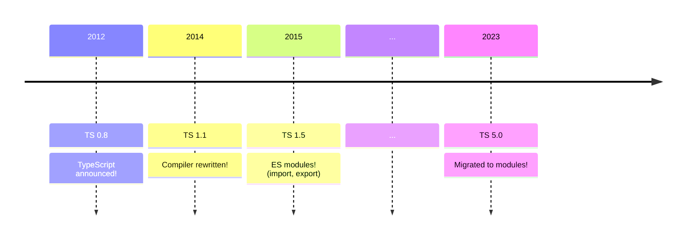

# Migrating TypeScript to Modules

<br>
<br>

## Jake Bailey

### Senior Software Engineer, Microsoft

<br>

jakebailey.dev/talk-ts-congress-2013

<style>
    p {
        text-align: right;
    }
</style>

---

# Outline

- What even _are_ modules?
- What does it mean to "_migrate_ to modules"?
- How did we do it?
- How did it go?
- What's next?

---

# What even _are_ modules?

- Modules are a _syntax_ (`import`, `export`)
- Modules are an _output format_ (CommonJS, ESM, SystemJS, AMD, UMD, IIFE, ...)
- Modules are _files_... except when they're not!

<br>

```ts
// @filename: src/someFile.ts
export function sayHello(name: string) {
    console.log(`Hello, ${name}!`);
}

// @filename: src/index.ts
import { sayHello } from "./someFile.js";

sayHello("TypeScript Congress");
```

<v-click>
<Arrow x1="600" y1="111" x2="450" y2="111" color="orangered" />
</v-click>

<!-- dprint-ignore-start -->

---
layout: fact
---

<!-- dprint-ignore-end -->

# ???

## How was TypeScript structured if _not_ with modules?

<style>
    h2 {
        font-size: 1.8rem;
    }
</style>

<!-- ---

# A little history...



<v-click>
<Text>So, if TypeScript predates module syntax, how was the compiler structured?</Text>
</v-click> -->

<!-- dprint-ignore-start -->

---
clicks: 3 # Hack; default is miscounted as 6
---

<!-- dprint-ignore-end -->

# TypeScript as of 4.9

```ts {|2,4,7,11|3|9}
// @filename: src/compiler/parser.ts
namespace ts {
    export function createSourceFile(sourceText: string): SourceFile {/* ... */}
}

// @filename: src/compiler/program.ts
namespace ts {
    export function createProgram(): Program {
        const sourceFile = createSourceFile(text);
    }
}
```

<v-clicks at="0">

- Code is organized into "namespaces".
- Declarations are exported using `export`.
- Other namespaces can reference exported declarations _implicitly_.

</v-clicks>

<!-- dprint-ignore-start -->

---
clicks: 3 # Hack; default is miscounted as 6
---

<!-- dprint-ignore-end -->

# The output

<!-- When combined with `outFile`, this gives: -->

```ts {|1,2,5,7,12|3,4|9}
var ts;
(function(ts) {
    function createSourceFile(sourceText) {/* ... */}
    ts.createSourceFile = createSourceFile;
})(ts || (ts = {}));

(function(ts) {
    function createProgram() {
        const sourceFile = ts.createSourceFile(text);
    }
    ts.createProgram = createProgram;
})(ts || (ts = {}));
```

<v-clicks at="0">

- Namespaces are "plain old JavaScript objects" plus a little function scoping.
- Exported declarations are properties on the namespace object.
- Implicit "imports" become object accesses. (Surprise!)

</v-clicks>

---

# Namespaces have some upsides

<v-clicks depth="2">

- With namespaces, we don't have to write imports, ever! 😅
  - Everything _feels_ local.
  - New code doesn't need to be imported.
  - Moving code from one file to another doesn't require modifying imports.
- Plain objects let us use clever tricks to support multiple environments.

</v-clicks>

<v-after>
```ts
var ts;
// If we're in CommonJS, export `ts`, but in <script>, `ts` is global!
if (typeof module !== "undefined" && module.exports) {
    module.exports = ts;
}
```
</v-after>

---

# But...

- Every access to something defined in another file is a property access.
  - This runtime cost adds up!
- We completely miss out "dogfooding" our own module experience.
  - Resolution modes
  - Auto-imports
  - Import sorting/organization
- We can't use any tooling that needs imports, or that skips `tsc`.

<!-- dprint-ignore-start -->

---
clicks: 3 # Hack; default is miscounted as 6
---

<!-- dprint-ignore-end -->

# What if we were modules?

```ts {|2|5,6|9}
// @filename: src/compiler/parser.ts
export function createSourceFile(sourceText: string): SourceFile {/* ... */}

// @filename: src/compiler/program.ts
import { createSourceFile } from "./parser";
import { Program } from "./types";

export function createProgram(): Program {
    const sourceFile = createSourceFile(text);
}
```

<v-clicks at="0">

- Declarations are still exported with `export`.
- External declarations are _explicitly_ imported with `import`.
- Imported declarations "look" local (just like before).

</v-clicks>

---

# Goals

How can we...

- Switch to imports (duh).
- Preserve the same behavior.
- Preserve our public API.

All while the team is still working!

_Oh, and also..._

---

# TS is huge!

<LightOrDark>
<template #dark><TSReleaseByLines theme="dark" /></template>
<template #light><TSReleaseByLines theme="light" /></template>
</LightOrDark>

<!-- So, any solution will need to scale up. -->

---

TODO: timeline of module formats, syntax, TS releases

---

todo...
