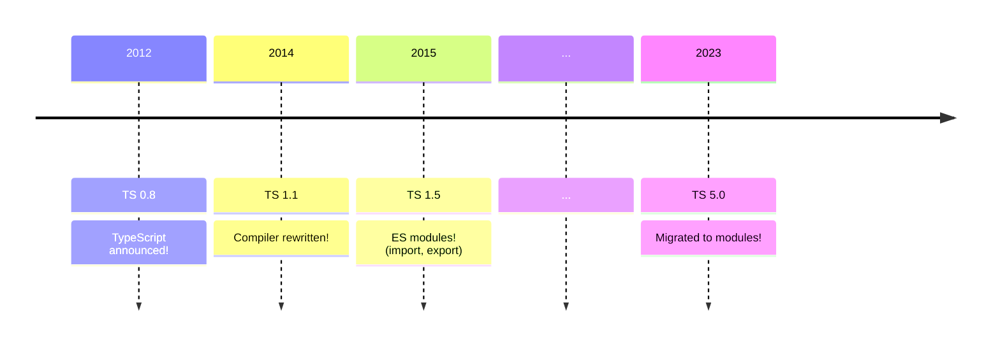

# Migrating TypeScript to Modules

<h2 id="cover-subtitle">The Fine Details</h2>

<br>
<br>
<br>
<br>

## Jake Bailey

#### Senior Software Engineer, Microsoft

<br>
<br>

[jakebailey.dev/talk-ts-congress-2013](https://jakebailey.dev/talk-ts-congress-2013)

<style>
    h1 {
        font-size: 3rem !important;
        /* margin-bottom: 0 !important; */
    }
    #cover-subtitle {
        font-size: 2rem;
        font-style: italic;
        opacity: 0.5;
    }
    p {
        text-align: right;
    }
</style>

---

# Outline

- What even _are_ modules?
- What does it mean to "_migrate_ to modules"?
- How did we do it?
- How did it go?
- What's next?

---

# What even _are_ modules?

- Modules are a _syntax_ (`import`, `export`)
- Modules are an _output format_ (CommonJS, ESM, SystemJS, AMD, UMD, IIFE, ...)
- Modules are _files_... except when they're not!

<br>

```ts
// @filename: src/someFile.ts
export function sayHello(name: string) {
    console.log(`Hello, ${name}!`);
}

// @filename: src/index.ts
import { sayHello } from "./someFile";

sayHello("TypeScript Congress");
```

<v-click>
<Arrow x1="600" y1="111" x2="450" y2="111" color="orangered" />
</v-click>

<!-- dprint-ignore-start -->

---
layout: fact
---

<!-- dprint-ignore-end -->

# ???

## How was TypeScript structured if _not_ with modules?

<style>
    h2 {
        font-size: 1.8rem;
    }
</style>

<!-- ---

# A little history...



<v-click>
<Text>So, if TypeScript predates module syntax, how was the compiler structured?</Text>
</v-click> -->

<!-- dprint-ignore-start -->

---
clicks: 3 # Hack; default is miscounted as 6
---

<!-- dprint-ignore-end -->

# TypeScript as of 4.9

```ts {|2,4,7,11|3|9}
// @filename: src/compiler/parser.ts
namespace ts {
    export function createSourceFile(sourceText: string): SourceFile {/* ... */}
}

// @filename: src/compiler/program.ts
namespace ts {
    export function createProgram(): Program {
        const sourceFile = createSourceFile(text);
    }
}
```

<v-clicks at="0">

- Code is organized into "namespaces".
- Declarations are exported using `export`.
- Other namespaces can reference exported declarations _implicitly_.

</v-clicks>

<!-- dprint-ignore-start -->

---
clicks: 3 # Hack; default is miscounted as 6
---

<!-- dprint-ignore-end -->

# The output

<!-- When combined with `outFile`, this gives: -->

```ts {|1,2,5,6,11|3,4|8}
var ts;
(function(ts) {
    function createSourceFile(sourceText) {/* ... */}
    ts.createSourceFile = createSourceFile;
})(ts || (ts = {}));
(function(ts) {
    function createProgram() {
        const sourceFile = ts.createSourceFile(text);
    }
    ts.createProgram = createProgram;
})(ts || (ts = {}));
```

<v-clicks at="0">

- Namespaces are "plain old JavaScript objects" plus a little function scoping.
- Exported declarations are properties on the namespace object.
- Implicit "imports" become object accesses. (Surprise!)

</v-clicks>

---

# Namespaces have some upsides

<v-clicks depth="2">

- With namespaces, we don't have to write imports, ever! 😅
  - Everything _feels_ local.
  - New code doesn't need to be imported.
  - Moving code from one file to another doesn't require modifying imports.
- Plain objects let us use clever tricks to support multiple environments.

</v-clicks>

<v-after>
```ts
var ts;
// If we're in CommonJS, export `ts`, but in <script>, `ts` is global!
if (typeof module !== "undefined" && module.exports) {
    module.exports = ts;
}
```
</v-after>

---

# But...

- Every access to something defined in another file is an object property
  access.
  - This runtime cost adds up!
- We completely miss out "dogfooding" our own module experience.
  - Resolution modes
  - Auto-imports
  - Import sorting/organization
- We can't use any tooling that needs imports, or that skips `tsc`.

<!-- dprint-ignore-start -->

---
clicks: 3 # Hack; default is miscounted as 6
---

<!-- dprint-ignore-end -->

# What if we were modules?

```ts {|2|5|8}
// @filename: src/compiler/parser.ts
export function createSourceFile(sourceText: string): SourceFile {/* ... */}

// @filename: src/compiler/program.ts
import { createSourceFile } from "./parser";

export function createProgram(): Program {
    const sourceFile = createSourceFile(text);
}
```

<v-clicks at="0">

- Declarations are still exported with `export`.
- External declarations are _explicitly_ imported with `import`.
- Imported declarations "look" local (just like before).

</v-clicks>

---

# Great! Let's do it.

How can we...

- Switch to imports (duh).
- Preserve the same behavior.
- Preserve our public API.

All while the team is still working!

_Oh, and also..._

---

# TS is huge!

<LightOrDark>
<template #dark><TSReleaseByLines theme="dark" /></template>
<template #light><TSReleaseByLines theme="light" /></template>
</LightOrDark>

<!-- So, any solution will need to scale up. -->

---

# If TS is so huge, how can we migrate?

Certainly not by hand!

- We'll _programmatically_ transform the codebase.
- Perform the operations we _would_ have done by hand.
- Use `ts-morph` for TS to TS transformation.
- Break things into steps so we can see what's going on.
  - More importantly, so `git` can see what's going on!
- Code: https://github.com/jakebailey/typeformer
- Follow along at: https://github.com/jakebailey/typescript/pull/1

---

# Step 0: Get everything loadable

- We're using `ts-morph` to do the transformation.
- `ts-morph` only supports a single "project" at at time.
- Loading `src/**/*.ts` gives us compiler errors due to our browser compat code.
- We can just remove the offending code and revert the change afterwards.

```diff
-/// <reference lib="webworker" />
-
 namespace ts.server {
+    declare const addEventListener: any;
+    declare const postMessage: any;
+    declare const close: any;
+    declare const location: any;
+    declare const XMLHttpRequest: any;
+    declare const self: any;
```

---

# Step 1: Unindent

- We're moving all of our code up one block, and so there's one fewer
  indentation!
- Do this early, so `git` can still trace the code back before the migration.

From:

```ts
namespace ts {
    export function createSourceFile(sourceText: string): SourceFile {/* ... */}
}
```

Into:

<!-- dprint-ignore-start -->

```ts
namespace ts {
export function createSourceFile(sourceText: string): SourceFile {/* ... */}
}
```

<!-- dprint-ignore-end -->

---

# Step 2: Make namespace accesses explicit

## 

This makes it easier to figure out imports later.

From:

```ts
export function createSourceFile(sourceText: string): SourceFile {
    const scanner = createScanner(sourceText);
}
```

Into:

```ts
export function createSourceFile(sourceText: string): ts.SourceFile {
    const scanner = ts.createScanner(sourceText);
}
```

---

# Step 3: Strip namespaces (the big one!)

## 

Given:

<!-- dprint-ignore-start -->

```ts
namespace ts {
export function createSourceFile(sourceText: string): ts.SourceFile {
    const scanner = ts.createScanner(sourceText);
}
}
```

<!-- dprint-ignore-end -->

We'll convert this into:

```ts
import * as ts from "./_namespaces/ts";

export function createSourceFile(sourceText: string): ts.SourceFile {
    const scanner = ts.createScanner(sourceText);
}
```

---

# `_namespaces`?

## 

_Ideally_, we'd actually want to write:

```ts
import { SourceFile } from "./types";
import { createScanner } from "./scanner";

export function createSourceFile(sourceText: string): SourceFile {
    const scanner = createScanner(sourceText);
}
```

But, there's a problem.

---

# TypeScript is _cyclic!_



```mermaid
graph TD
    builder.ts --> builderState.ts
    builder.ts --> debug.ts
    builder.ts --> builderPublic.ts
    builder.ts --> watchPublic.ts
    builderPublic.ts --> builder.ts
    builderState.ts --> moduleNameResolver.ts
    builderState.ts --> debug.ts
    commandLineParser.ts --> debug.ts
    commandLineParser.ts --> sys.ts
    commandLineParser.ts --> tsbuildPublic.ts
    commandLineParser.ts --> utilities.ts
    commandLineParser.ts --> tracing.ts
    core.ts --> debug.ts
    debug.ts --> core.ts
    debug.ts --> utilities.ts
    emitter.ts --> debug.ts
    emitter.ts --> performance.ts
    emitter.ts --> tracing.ts
    emitter.ts --> builder.ts
    emitter.ts --> utilities.ts
    moduleNameResolver.ts --> debug.ts
    moduleNameResolver.ts --> semver.ts
    moduleNameResolver.ts --> program.ts
    moduleSpecifiers.ts --> utilities.ts
    moduleSpecifiers.ts --> debug.ts
    moduleSpecifiers.ts --> moduleNameResolver.ts
    parser.ts --> utilities.ts
    parser.ts --> factory/nodeFactory.ts
    parser.ts --> tracing.ts
    parser.ts --> performance.ts
    parser.ts --> debug.ts
    parser.ts --> scanner.ts
    parser.ts --> core.ts
    path.ts --> debug.ts
    performance.ts --> debug.ts
    performance.ts --> sys.ts
    program.ts --> emitter.ts
    program.ts --> transformers/declarations.ts
    program.ts --> path.ts
    program.ts --> performance.ts
    program.ts --> sys.ts
    program.ts --> parser.ts
    program.ts --> builderPublic.ts
    program.ts --> debug.ts
    program.ts --> moduleNameResolver.ts
    program.ts --> tracing.ts
    program.ts --> utilities.ts
    program.ts --> core.ts
    program.ts --> semver.ts
    program.ts --> watchUtilities.ts
    resolutionCache.ts --> moduleNameResolver.ts
    resolutionCache.ts --> sys.ts
    resolutionCache.ts --> debug.ts
    resolutionCache.ts --> program.ts
    resolutionCache.ts --> core.ts
    resolutionCache.ts --> watchUtilities.ts
    scanner.ts --> debug.ts
    semver.ts --> debug.ts
    sys.ts --> debug.ts
    sys.ts --> core.ts
    sys.ts --> utilities.ts
    tracing.ts --> debug.ts
    tracing.ts --> performance.ts
    tsbuildPublic.ts --> emitter.ts
    tsbuildPublic.ts --> sys.ts
    tsbuildPublic.ts --> path.ts
    tsbuildPublic.ts --> program.ts
    tsbuildPublic.ts --> watchPublic.ts
    tsbuildPublic.ts --> moduleNameResolver.ts
    tsbuildPublic.ts --> performance.ts
    tsbuildPublic.ts --> commandLineParser.ts
    tsbuildPublic.ts --> watchUtilities.ts
    tsbuildPublic.ts --> debug.ts
    tsbuildPublic.ts --> builderPublic.ts
    tsbuildPublic.ts --> builder.ts
    tsbuildPublic.ts --> watch.ts
    utilities.ts --> moduleNameResolver.ts
    utilities.ts --> debug.ts
    utilities.ts --> program.ts
    utilities.ts --> scanner.ts
    utilities.ts --> utilitiesPublic.ts
    utilities.ts --> commandLineParser.ts
    utilities.ts --> sys.ts
    utilities.ts --> core.ts
    utilitiesPublic.ts --> debug.ts
    watch.ts --> sys.ts
    watch.ts --> program.ts
    watch.ts --> commandLineParser.ts
    watch.ts --> tsbuildPublic.ts
    watch.ts --> builderPublic.ts
    watch.ts --> moduleNameResolver.ts
    watch.ts --> debug.ts
    watch.ts --> watchUtilities.ts
    watch.ts --> watchPublic.ts
    watchPublic.ts --> path.ts
    watchPublic.ts --> sys.ts
    watchPublic.ts --> watchUtilities.ts
    watchPublic.ts --> debug.ts
    watchPublic.ts --> watch.ts
    watchPublic.ts --> resolutionCache.ts
    watchPublic.ts --> builderPublic.ts
    watchPublic.ts --> commandLineParser.ts
    watchUtilities.ts --> path.ts
    watchUtilities.ts --> debug.ts
    watchUtilities.ts --> sys.ts
    watchUtilities.ts --> builderPublic.ts
    watchUtilities.ts --> builderState.ts
    factory/baseNodeFactory.ts --> utilities.ts
    factory/nodeFactory.ts --> debug.ts
    factory/nodeFactory.ts --> factory/baseNodeFactory.ts
    factory/nodeFactory.ts --> scanner.ts
    factory/nodeFactory.ts --> utilitiesPublic.ts
    factory/nodeFactory.ts --> utilities.ts
    transformers/declarations.ts --> debug.ts
    transformers/declarations.ts --> transformers/declarations/diagnostics.ts
    transformers/declarations.ts --> utilities.ts
    transformers/declarations.ts --> moduleSpecifiers.ts
    transformers/declarations/diagnostics.ts --> utilitiesPublic.ts
    transformers/declarations/diagnostics.ts --> debug.ts
```

Everything above is a part of a cycle!

---

# TypeScript is _cyclic!_



```mermaid
graph TD
    builder.ts ~~~ builderState.ts
    builder.ts ~~~ debug.ts
    builder.ts ~~~ builderPublic.ts
    builder.ts ~~~ watchPublic.ts
    builderPublic.ts ~~~ builder.ts
    builderState.ts ~~~ moduleNameResolver.ts
    builderState.ts ~~~ debug.ts
    commandLineParser.ts ~~~ debug.ts
    commandLineParser.ts ~~~ sys.ts
    commandLineParser.ts ~~~ tsbuildPublic.ts
    commandLineParser.ts ~~~ utilities.ts
    commandLineParser.ts ~~~ tracing.ts
    core.ts ~~~ debug.ts
    debug.ts ~~~ core.ts
    debug.ts ==> utilities.ts
    emitter.ts ~~~ debug.ts
    emitter.ts ~~~ performance.ts
    emitter.ts ~~~ tracing.ts
    emitter.ts ~~~ builder.ts
    emitter.ts ~~~ utilities.ts
    moduleNameResolver.ts ~~~ debug.ts
    moduleNameResolver.ts ~~~ semver.ts
    moduleNameResolver.ts ~~~ program.ts
    moduleSpecifiers.ts ~~~ utilities.ts
    moduleSpecifiers.ts ~~~ debug.ts
    moduleSpecifiers.ts ~~~ moduleNameResolver.ts
    parser.ts ~~~ utilities.ts
    parser.ts ~~~ factory/nodeFactory.ts
    parser.ts ~~~ tracing.ts
    parser.ts ~~~ performance.ts
    parser.ts ~~~ debug.ts
    parser.ts ==> scanner.ts
    parser.ts ~~~ core.ts
    path.ts ~~~ debug.ts
    performance.ts ~~~ debug.ts
    performance.ts ~~~ sys.ts
    program.ts ~~~ emitter.ts
    program.ts ~~~ transformers/declarations.ts
    program.ts ~~~ path.ts
    program.ts ~~~ performance.ts
    program.ts ~~~ sys.ts
    program.ts ==> parser.ts
    program.ts ~~~ builderPublic.ts
    program.ts ~~~ debug.ts
    program.ts ~~~ moduleNameResolver.ts
    program.ts ~~~ tracing.ts
    program.ts ~~~ utilities.ts
    program.ts ~~~ core.ts
    program.ts ~~~ semver.ts
    program.ts ~~~ watchUtilities.ts
    resolutionCache.ts ~~~ moduleNameResolver.ts
    resolutionCache.ts ~~~ sys.ts
    resolutionCache.ts ~~~ debug.ts
    resolutionCache.ts ~~~ program.ts
    resolutionCache.ts ~~~ core.ts
    resolutionCache.ts ~~~ watchUtilities.ts
    scanner.ts ==> debug.ts
    semver.ts ~~~ debug.ts
    sys.ts ~~~ debug.ts
    sys.ts ~~~ core.ts
    sys.ts ~~~ utilities.ts
    tracing.ts ~~~ debug.ts
    tracing.ts ~~~ performance.ts
    tsbuildPublic.ts ~~~ emitter.ts
    tsbuildPublic.ts ~~~ sys.ts
    tsbuildPublic.ts ~~~ path.ts
    tsbuildPublic.ts ~~~ program.ts
    tsbuildPublic.ts ~~~ watchPublic.ts
    tsbuildPublic.ts ~~~ moduleNameResolver.ts
    tsbuildPublic.ts ~~~ performance.ts
    tsbuildPublic.ts ~~~ commandLineParser.ts
    tsbuildPublic.ts ~~~ watchUtilities.ts
    tsbuildPublic.ts ~~~ debug.ts
    tsbuildPublic.ts ~~~ builderPublic.ts
    tsbuildPublic.ts ~~~ builder.ts
    tsbuildPublic.ts ~~~ watch.ts
    utilities.ts ~~~ moduleNameResolver.ts
    utilities.ts ~~~ debug.ts
    utilities.ts ==> program.ts
    utilities.ts ~~~ scanner.ts
    utilities.ts ~~~ utilitiesPublic.ts
    utilities.ts ~~~ commandLineParser.ts
    utilities.ts ~~~ sys.ts
    utilities.ts ~~~ core.ts
    utilitiesPublic.ts ~~~ debug.ts
    watch.ts ~~~ sys.ts
    watch.ts ~~~ program.ts
    watch.ts ~~~ commandLineParser.ts
    watch.ts ~~~ tsbuildPublic.ts
    watch.ts ~~~ builderPublic.ts
    watch.ts ~~~ moduleNameResolver.ts
    watch.ts ~~~ debug.ts
    watch.ts ~~~ watchUtilities.ts
    watch.ts ~~~ watchPublic.ts
    watchPublic.ts ~~~ path.ts
    watchPublic.ts ~~~ sys.ts
    watchPublic.ts ~~~ watchUtilities.ts
    watchPublic.ts ~~~ debug.ts
    watchPublic.ts ~~~ watch.ts
    watchPublic.ts ~~~ resolutionCache.ts
    watchPublic.ts ~~~ builderPublic.ts
    watchPublic.ts ~~~ commandLineParser.ts
    watchUtilities.ts ~~~ path.ts
    watchUtilities.ts ~~~ debug.ts
    watchUtilities.ts ~~~ sys.ts
    watchUtilities.ts ~~~ builderPublic.ts
    watchUtilities.ts ~~~ builderState.ts
    factory/baseNodeFactory.ts ~~~ utilities.ts
    factory/nodeFactory.ts ~~~ debug.ts
    factory/nodeFactory.ts ~~~ factory/baseNodeFactory.ts
    factory/nodeFactory.ts ~~~ scanner.ts
    factory/nodeFactory.ts ~~~ utilitiesPublic.ts
    factory/nodeFactory.ts ~~~ utilities.ts
    transformers/declarations.ts ~~~ debug.ts
    transformers/declarations.ts ~~~ transformers/declarations/diagnostics.ts
    transformers/declarations.ts ~~~ utilities.ts
    transformers/declarations.ts ~~~ moduleSpecifiers.ts
    transformers/declarations/diagnostics.ts ~~~ utilitiesPublic.ts
    transformers/declarations/diagnostics.ts ~~~ debug.ts
```

Everything above is a part of a cycle! &nbsp; &nbsp; (Here's just one of them.)

<!-- So, to fix this, we need to get fancy. -->

---

# Introducing... "namespace barrels"

- Our old runtime order was defined by the `files` array in `tsconfig.json`.
- We either need to fix the cycles or try and emulate that behavior.
  - The latter is easier!

```ts
// @filename: src/compiler/_namespaces/ts.ts
export * from "../core"; // In the order specified in tsconfig.json
export * from "../corePublic";
export * from "../debug";
// ...

// @filename: src/compiler/checker.ts
import * as ts from "./_namespaces/ts";
```

These namespace barrels help define execution order, and provide us with a `ts`
object that looks like the old namespace object at runtime.

<!--
Technically, the execution order of ES module imports like this is undefined.
But, when using a bundler or emitting to CJS, the order will be kept, which is
good enough for us.
 -->

---

# Nested "namespace barrels"

## 

Namespaces can be nested, like:

```ts
// @filename: src/compiler/performance.ts
namespace ts.performance {
    export function mark(label: string) {/* ... */}
}
```

This too can be emulated using reexports:

```ts
// @filename: src/compiler/_namespaces/ts.ts
export * as performance from "./ts.performance";

// @filename: src/compiler/_namespaces/ts.performance.ts;
export * from "../performance";

// @filename: src/compiler/performance.ts
export function mark(label: string) {/* ... */}
```

---

# Merging "namespace barrels"

## 

To emulate project references and `prepend`, we can merge modules!

```ts
// @filename: src/server/_namespaces/ts.ts
export * from "../../compiler/_namespaces/ts";
export * from "../../services/_namespaces/ts";
export * from "../../deprecatedCompat/_namespaces/ts";

// @filename: src/server/project.ts
import * as ts from "./_namespaces/ts";
```

This namespace import provides a "view" that mimics the `ts` namespace we used
to observe before modules.

---

# Also, this gives us our public API!

## 

Say, `typescript.js`.

```ts
// @filename: src/typescript/_namespaces/ts.ts
export * from "../../compiler/_namespaces/ts";
export * from "../../services/_namespaces/ts";
export * from "../../deprecatedCompat/_namespaces/ts";

// @filename: src/typescript/typescript.ts
import * as ts from "./_namespace/ts";
export = ts; // <-- This is what API consumers see!
```

---

# Also, this gives us our public API!

## 

Or, `tsserverlibrary.js`.

```ts
// @filename: src/tsserverlibrary/_namespaces/ts.ts
export * from "../../compiler/_namespaces/ts";
export * from "../../services/_namespaces/ts";
export * from "../../server/_namespaces/ts";
import * as server from "./ts.server";
export { server };

// @filename: src/tsserverlibrary/tsserverlibrary.ts
import * as ts from "./_namespace/ts";
export = ts; // <-- This is what API consumers see!
```

---

# Anyway... Step 3

## 

Now that we have an idea of where we're going, the transform should:

- Determine which namespace the file defined.
- Determine which namespaces need to be imported.
- Create the `_namespace` files, reexporting their contents.
- Lift all code out of `namespace` blocks, then delete the `namespace`.
- Insert imports at the top.
- Drop all of the dead `tsconfig.json` configuration (`prepend`, `outFile`).

Afterwards, we're left with a codebase which compiles without error! 🎉

---

# Step 4: Convert to named imports

## 

After step 3, we're left with fully qualified imports, like:

```ts
import * as ts from "./_namespaces/ts";

export function createSourceFile(sourceText: string): ts.SourceFile {
    const scanner = ts.createScanner(sourceText);
}
```

This step transforms the above into:

```ts
import { createScanner, SourceFile } from "./_namespaces/ts";

export function createSourceFile(sourceText: string): SourceFile {
    const scanner = createScanner(sourceText);
}
```

---

# Step 4: Convert to named imports, cont.

- This is _almost_ our desired code, just indirecting through "namespace
  barrels".
- But, that's a good tradeoff for now!
  - With imports, we can use tools like `madge` or `dpdm` to find cycles.

<!-- TODO: spacing -->

```ts
import { createScanner, SourceFile } from "./_namespaces/ts";

export function createSourceFile(sourceText: string): SourceFile {
    const scanner = createScanner(sourceText);
}
```

---

# ... and then draw the rest of the owl

## 

At this point, all of the hard work is done!

As `main` updates, we can rebase and rerun each of these automated steps. This
lets the team continue working until the moment we're ready to go.

But, there are still lots of fiddly bits left.


<!-- <LightOrDark>
<template #dark></template>
<template #light></template>
</LightOrDark> -->

<style>
img {
    height: 50%;
    margin-left: auto;
    margin-right: auto;
}
.inverted {
    filter: invert(1);
}
</style>

---

# Manual changes

## 

After the automation, there were _29_ manual changes (stored in patches for
`git am`).

Let's go over some highlights.

<!-- TODO: maybe just link to the blog post -->

---

# Bundling with `esbuild`

- Our old outputs were a handful of large-ish bundles produced by `outFile`.
  - People depend on that.
- Lots of bundlers to choose from; we went with `esbuild`.
- Obviously, it's fast.
- Supports scope hoisting, tree shaking, enum inlining, and is pretty easy to
  work with.
- Still have to mess around with the output a little... remember this?

```js
// --format=iife --global-name=ts --footer="if ..."
var ts (() => {
    // ...
    return { /* ... */ };
})();
// If we're in CommonJS, export `ts`, but in <script>, `ts` is global!
if (typeof module !== "undefined" && module.exports) {
    module.exports = ts;
}
```

---

# `d.ts` bundling

- Along with "bundled" `.js` files, `tsc`'s `outFile` also produced `.d.ts`
  files.
  - But now we're using esbuild, which doesn't produce `d.ts` files.
- We ended up rolling our own (small, very limited) `d.ts` bundler.
- Definitely not for external use; it's very specific to our API.

```ts
// Something like...
namespace ts {
    function createSourceFile(): SourceFile;

    namespace server {
        namespace protocol {
            // ...
        }
    }
}
export = ts;
```

---

# Complete build overhaul

## 

- Our old build was `gulp`.
  - Calls out to `tsc`, streams to modify files, the works.
  - Complicated web of `series` and `parallel` tasks.
- New build has all new steps, but removes many others.
- Build completely replaced, reimplemented in a new task runner!
  - Plain JS functions with an explicit dependency graph, as parallel as
    possible.
- It's called `hereby`, don't use it, thanks.

```ts
export const buildSrc = task({
    name: "build-src",
    description: "Builds the src project (all code)",
    dependencies: [generateDiagnostics],
    run: () => buildProject("src"),
});
```

<!--
Old build had been gulp since 2016, `jake` before that.

Feature complete at ~500 lines of code. Maybe if I had worked on this
months later, I would have tried `wireit`.
 -->

---

# How did it go?

Great!

- Core development loop performance boost
- Performance boost from hoisting (TODO: numbers)
- Package size reduction (TODO: graph)
- Raised target, slowdown from `let`/`const`, converted some blocks to `var`.
  (TODO: numbers?)
- Dogfooding!
  - Found auto-import bugs
  - Improvements to import organization and better ecosystem handling
  - All because we finally can experience modules.

---

# What's next?

TODO

- Removing cycles from the codebase
- Shipping ESM for executables (maybe even the API)
- Minification? (probably not, because patchers)

---

# Thanks for watching!

<br>
<br>
<br>

### Find me at [jakebailey.dev](https://jakebailey.dev)
