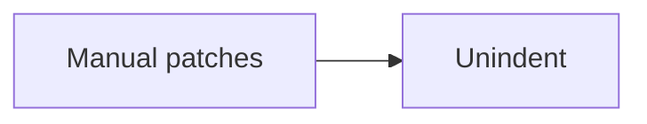

# TypeScript's Transition to Modules

## Jake Bailey

### Senior Software Engineer, Microsoft

---

# Outline

- What even _are_ modules?
- What does it mean to "switch to modules"?
- How did we do it?
- How did it go?
- What's next?

---

# Goals

How can we...

- Switch to imports (duh)
- Preserve the same behavior
- Preserve our public API

All while the team is still working!

Oh, and also...

---

# TS is huge!

<LightOrDark>
<template #dark><TSReleaseByLines theme="dark" /></template>
<template #light><TSReleaseByLines theme="light" /></template>
</LightOrDark>

<!-- So, any solution will need to scale up. -->

---

# So, what even _are_ modules?

- Modules are a _syntax_ (`import`, `export`)
- Modules are an _output format_ (CJS, ESM, System, AMD, UMD, IIFE, ...)
- Modules are _individual files_... except when they're not!

---

TODO: timeline of module formats, syntax, TS releases

---

todo...

---

# The conversion process

